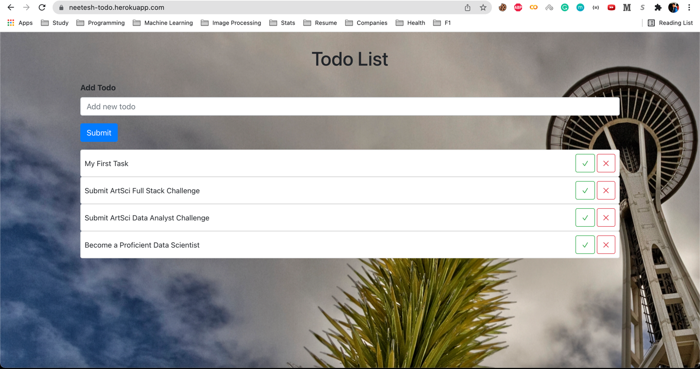

# Todo Application
This is a minute version of a TODO app that will let the user keep track of their tasks, allow them to add new task,
mark current tasks as completed and delete tasks from the list.

For the application, NodeJS has been used as the backend-architecture and ReactJS is used for front-end
user interface.

### Libraries Used
The application consists of primarily libraries which are most commonly used in Industrial setting.
Here is a brief description of the important libraries used:
1. <u>**BACK-END**</u> -
   1. _NODE_ - Being a very reliable and lightweight RESTFul service architecture, node has been used as the primary back-end engine.
   2. _EXPRESS_ - Express is a minimal and flexible Node.js web application framework that provides a robust set of features for web and mobile applications. Inside express, With a myriad of HTTP utility methods and middleware at your disposal, creating a robust API is quick and easy.
   3. _HTTP-ERRORS_ - HTTP-errors module is used for generating errors for Node.js applications. It is very easy to use
   4. _MORGAN_ - Morgan is an HTTP request level Middleware. It is a great tool that logs the requests along with some other information depending upon its configuration and the preset used. It proves to be very helpful while debugging and also if you want to create Log files.

2. <u>**FRONT-END**</u> - 
   1. _REACT_ - React is a declarative, efficient, and flexible JavaScript library for building user interfaces. It lets you compose complex UIs from small and isolated pieces of code called “components”. Here are some pointers on why choosing React:
      1. Simplicity: ReactJS is just simpler to grasp right away
      2. Easy to learn: Anyone with basic previous knowledge in programming can easily understand React. 
      3. Data Binding: React uses one-way data binding and an application architecture called Flux controls the flow of data to components through one control point – the dispatcher.
      4. Performance: React does not offer any concept of a built-in container for dependency.
   2. _REACT-BOOTSTRAP_ - React-Bootstrap replaces the Bootstrap JavaScript. Each component has been built from scratch as a true React component, without unneeded dependencies like jQuery. 
   3. _REACT-SCRIPTS_ - React-scripts is a set of scripts from the create-react-app starter pack. **create-react-app** helps us kick off projects without configuring, so we do not have to setup project by ourself.
   4. _REACT HOOKS_ - Hooks are a new addition in React 16.8. They let you use state and other React features without writing a class.
   5. _WEB-VITALS_ - The web-vitals library is a tiny (~1K), modular library for measuring all the Web Vitals metrics on real users, in a way that accurately matches how they're measured by Chrome and reported to other Google tools.

### Backend Data Structure

At the core of the backend, we have used javascript dictionary as the primary data structure for holding the todo object lists.
This is essentially a key-value pair map, where the key of the TODO object is it's unique-id, and the value is the TODO object itself.
Dictionary is used to retrieve and update todos in O(1) just by providing the key as it will return the TODO in constant time.
Here is a sample example for the stored TODOs - 

`{
'TD00001': {state: TODO_STATE.OPEN, text: 'My First Task'}
}`

Here `TD00001` is the todo_id which is unique (and should be primary key in the database) for the TODO.
The value contains the current state of the TODO (`OPEN` or `COMLETED`)

The state of the TODO is changed to `COMPLETED` on user action.

The uniqueId or primaryKey is auto-incremented and should be taken care by the DB / Backend for consistency.

### Deployment Architecture

The application contains bundled front-end and the backend both combined in it. From an industrial point-of-view
<u>AWS docker or kubernetes based ECS instances</u> would have been the ideal choice for deployment, as their management 
and scalability is pretty-simple and does not require too much of developer effort to setup and complete the release cycle.

However, the AWS instances are paid and requires proper cost analysis before any service or infra allocation. Since this is 
a demo project and does not require highly industrial scalability and deployment flexibility, we have opted for **Heroku** as 
the deployment service provider.

Heroku is a widely relied-upon platform as a service offering that enables developers to carry out hassle-free application deployment, scaling, and management.
Here are some of the key advantages of Heroku - 

1. <u> Free to Start</u> - Users can get started with the free tier of Heroku, which does come with some restrictions and fundamental functionality. This is good for students and personal projects, as they are individual and does not require full-fledged deployment pipeline.

2. <u> Easy to Use</u> - The free version of Heroku is best suited for small development projects. The intuitive Heroku platform dashboard helps users perform easy scaling, management, and application monitoring.

3. <u> Developer-Centric</u> - Heroku focuses on helping developers hone their skills to create feature-rich applications. The experience is favorable for developers as they access some useful tools to accelerate core development processes

4. <u> Powerful CLI </u> - Heroku Command Line Interface or CLI is a feature that helps to develop and manage Heroku applications conveniently

### Unexplored Challenges

Albeit with the sufficient industry background in the domain, every new projects let you learn something new. This project is a simple one and 
does not require more depth of the technical skills. However, **Deployment** is key concept and skill that beginners generally 
do not give much focus on. Choosing the right deployment strategy is of utmost important and saves a lot of valuable time and effort 
in the future.

I have always worked upon AWS on in-premise deployments directly and learning **Heroku** was a exciting thing to me.
I was amazed by the easy of deployment it provides. It's integration with Github is so smooth that the deployment gets triggered automatically
if the proper CI-CD pipeline is set up.

Learning this is superb, and will surely add up to my skill-portfolio.

### Github Repo Brief

This repo itself contains two major components. The backend code which is at the outer most level,
and the front-end code which can be found inside [./client](./client). Both components have their own `package.json` for the 
requisite dependencies.

The link for the complete repo is - [https://github.com/NeeteshDadwariya/todo-app](https://github.com/NeeteshDadwariya/todo-app)

### Live Deployments

The application is already live and can be accessed at -
[https://neetesh-todo.herokuapp.com/](https://neetesh-todo.herokuapp.com/)

Sample app screenshot -

